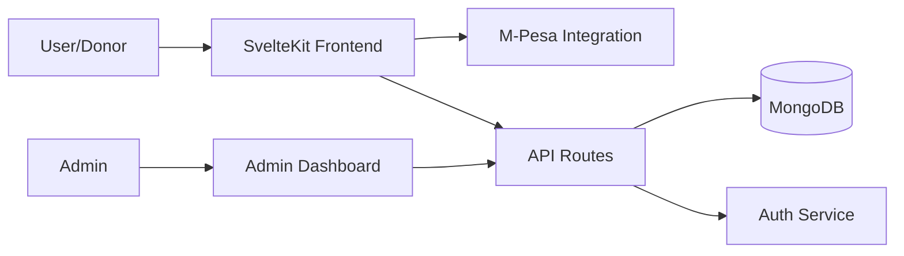

# SvelteKit Donation Dashboard with M-Pesa Integration

A modern, responsive donation platform built with SvelteKit that enables well-wishers to donate anonymously to various social projects through M-Pesa mobile money service. The platform includes a secure admin interface to track donations and manage projects.

## ✨ Features

- 🎯 Multiple donation projects support
- 💳 M-Pesa payment integration
- 📱 Responsive design with dark mode
- 🔒 Secure admin dashboard with dual authentication
- 📊 Real-time donation tracking
- 🌐 MongoDB database integration
- 🔐 JWT and Cookie-based authentication
- 🎨 Modern UI with Tailwind CSS
- 🌙 Dark mode support

## 🏗️ Tech Stack

- **Frontend**: SvelteKit
- **Styling**: Tailwind CSS
- **Backend**: Node.js
- **Database**: MongoDB
- **Payment**: M-Pesa API
- **Authentication**: JWT + HTTP-only Cookies
- **Deployment**: Vercel

## 🏛️ Architecture Overview



## 📁 Project Structure

```bash
project-root/
├── src/
│   ├── routes/
│   │   ├── +page.svelte           # Homepage with project listing
│   │   ├── admin/                 # Admin interface
│   │   └── api/                   # API endpoints
│   ├── lib/
│   │   ├── components/            # Reusable components
│   │   ├── db/                    # Database configuration
│   │   └── server/               # Server-side utilities
│   └── app.html                   # App template
├── static/                        # Static assets
├── .env                          # Environment variables
├── svelte.config.js
├── tailwind.config.js
└── package.json
```

## 🚀 Getting Started

### Prerequisites

- Node.js (v16 or higher)
- npm or yarn
- MongoDB Atlas account or local MongoDB instance
- M-Pesa API credentials (Safaricom Developer Account)

### Installation

1. Clone the repository:
```bash
git clone https://github.com/your-username/svelte-donation-dashboard.git
cd svelte-donation-dashboard
```

2. Install dependencies:
```bash
npm install
```

3. Create a `.env` file in the root directory:
```env
# Database
MONGODB_URI=your_mongodb_connection_string

# Authentication
JWT_SECRET=your_jwt_secret
COOKIE_SECRET=your_cookie_secret

# M-Pesa Integration
MPESA_CONSUMER_KEY=your_mpesa_consumer_key
MPESA_CONSUMER_SECRET=your_mpesa_consumer_secret
MPESA_PASSKEY=your_mpesa_passkey
MPESA_SHORTCODE=your_mpesa_shortcode
MPESA_CALLBACK_URL=your_mpesa_callback_url

# Admin Configuration
ADMIN_EMAIL=admin@example.com
ADMIN_PASSWORD=your_admin_password
```

4. Start the development server:
```bash
npm run dev
```

5. Visit `http://localhost:5173` in your browser

## 🔒 Authentication System

The application uses a dual authentication system for enhanced security:

1. **JWT Token Authentication**
   - Used for API requests
   - Stored in memory (not in localStorage)
   - Auto-refresh mechanism

2. **HTTP-only Cookie Authentication**
   - Used for session management
   - Secure and HttpOnly flags
   - SameSite protection

## 💰 M-Pesa Integration

### Setting Up M-Pesa API

1. Register for a Safaricom Developer Account at [Daraja Portal](https://developer.safaricom.co.ke/)
2. Create a new app to get your credentials
3. Configure callback URLs
4. Test with sandbox credentials

### Testing M-Pesa Integration

- Use Safaricom's test credentials for development
- Test phone numbers format: 254XXXXXXXXX
- Test amount range: 10 - 150,000 KES

## 🌐 API Endpoints

| Method | Endpoint | Description |
|--------|----------|-------------|
| GET | /api/projects | Fetch all projects |
| POST | /api/donate | Initiate M-Pesa payment |
| POST | /api/mpesa/callback | Handle M-Pesa confirmation |
| GET | /api/admin/stats | Get donation statistics |

## 🚀 Deployment

### Deploying to Vercel

1. Push your code to GitHub
2. Import your repository in Vercel
3. Configure environment variables
4. Deploy!

### Environment Variables in Vercel

Required environment variables are specified in `vercel.json`:
- MONGODB_URI
- JWT_SECRET
- MPESA_CONSUMER_KEY
- MPESA_CONSUMER_SECRET
- MPESA_PASSKEY
- MPESA_SHORTCODE
- MPESA_CALLBACK_URL
- ADMIN_EMAIL
- ADMIN_PASSWORD

## 🐳 Docker Support

Run with Docker Compose:
```bash
docker-compose up -d
```

## 🔧 Troubleshooting

Common issues and solutions:

1. **MongoDB Connection Issues**
   - Check MongoDB Atlas IP whitelist
   - Verify connection string format
   - Ensure network connectivity

2. **M-Pesa API Errors**
   - Verify phone number format (254XXXXXXXXX)
   - Check API credentials
   - Ensure callback URL is accessible

## 🛣️ Roadmap

- [ ] Multi-language support
- [ ] Enhanced analytics dashboard
- [ ] Automated email receipts
- [ ] Social media sharing
- [ ] Multiple payment methods
- [ ] Recurring donations

## 🤝 Contributing

Contributions are welcome! Please feel free to submit a Pull Request.

## 📄 License

This project is licensed under the MIT License - see the LICENSE file for details.

## 📧 Contact

For any inquiries, please reach out to the project maintainer:
- GitHub: [@mokwathedeveloper](https://github.com/mokwathedeveloper)